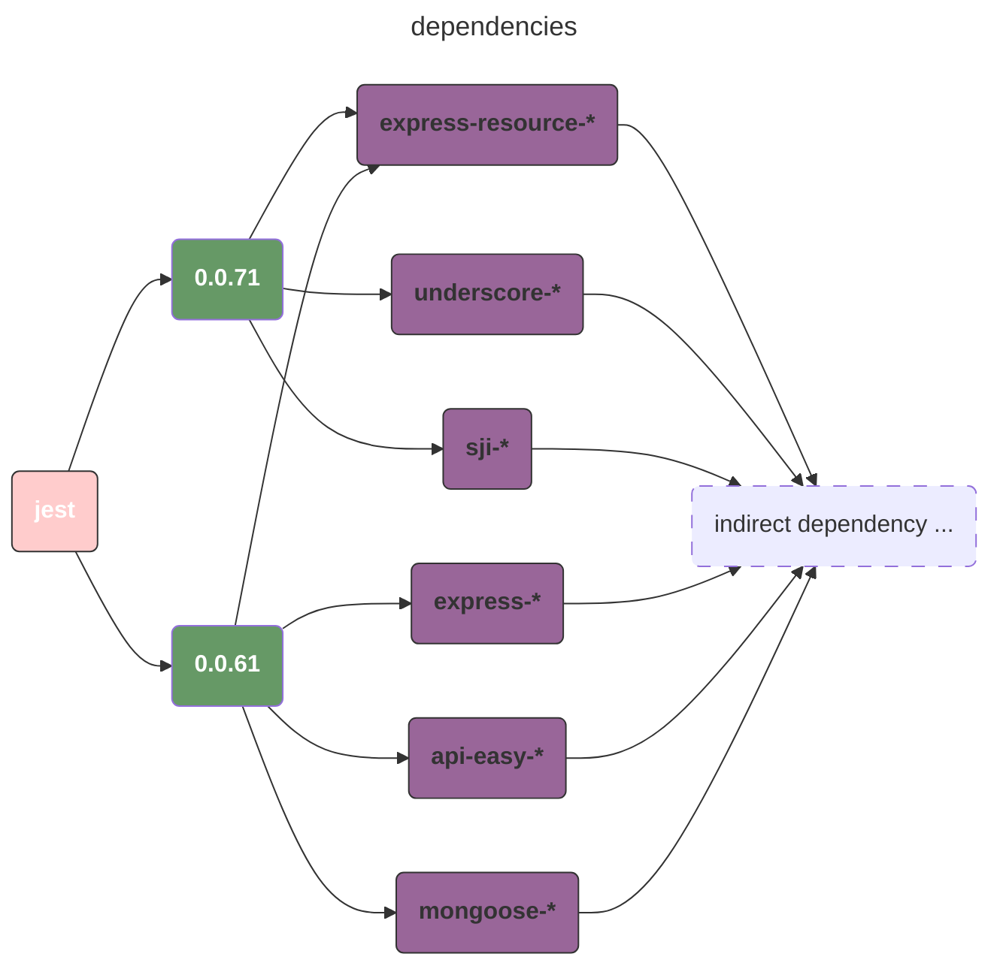
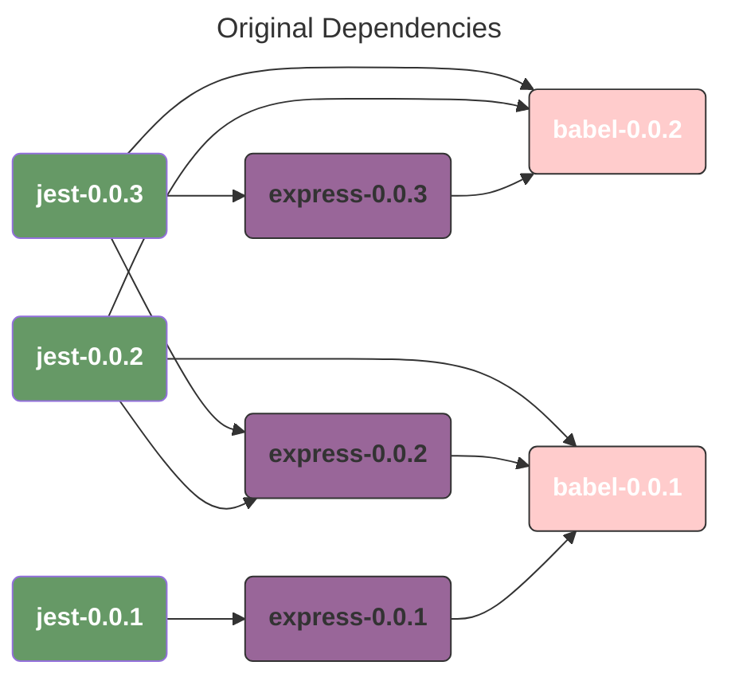
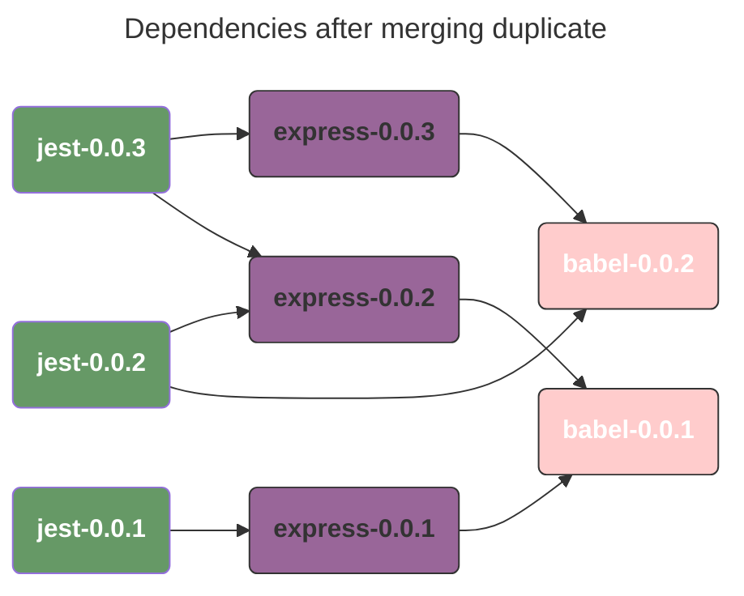

# tiny-package-manager
A tiny package manager for trying my hand at Python.

## TEST

```bash
uv run pytest -v
```

## DESCRIPTION

## ANALYSING DEPENDENCIES

First of all, we must make it clear what the differences between `direct dependencies` and `indirect dependencies` are. Here is a simple example:




We can start our incremental parse now. The solution is quite simple:

1. We have `available`, `unresolved`. At the beginning, available is empty and unresolved is equal to  all direct dependencies.
2. Download all direct dependencies and then analyse their dependencies; tshe results are new unresolved dependencies.
3. Keep analysing unresolved dependencies until they become empty, which means the resolution is complete; or we may encounter errors like version conflicts, which means the resolution has failed.

## ARE ALL DEPENDENCIES  FINISHED?

> `((jest, 0.0.1), (express, 3), (babel, 3))` ， our goal is to check whether the version is legal.

```json
{
  "jest": {
    "0.0.3": {"express": ["0.0.3", "0.0.2"], "babel": ["0.0.2"]},
    "0.0.2": {"express": ["0.0.2"],      "babel": ["0.0.2", "0.0.1"]},
    "0.0.1": {"express": ["0.0.1"]}
  },
  "express": {
    "0.0.3": {"babel": ["0.0.2"]},
    "0.0.2": {"babel": ["0.0.1"]},
    "0.0.1": {"babel": ["0.0.1"]}
  },
  "babel": {
    "0.0.2": [],
    "0.0.1": []
  }
}
```




