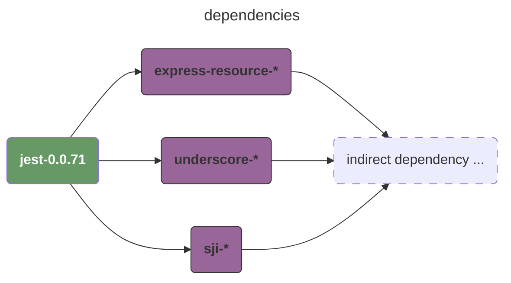
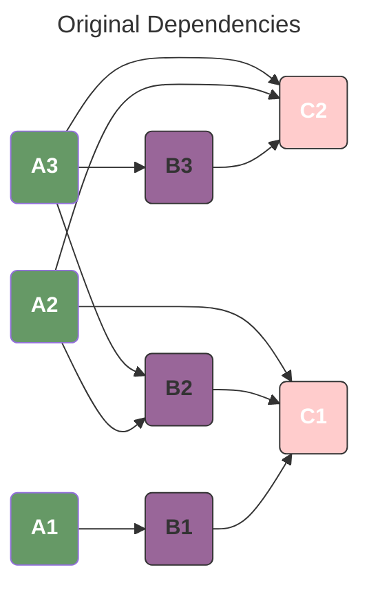
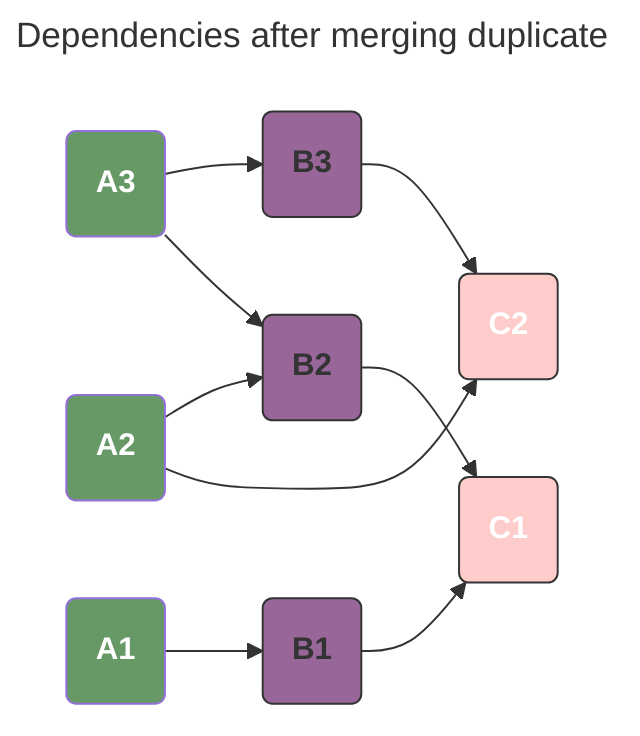

# tiny-package-manager
A tiny package manager for trying my hand at Python.

## TEST

```bash
uv run pytest -v
```

## DESCRIPTION

## ANALYSING DEPENDENCIES

First of all, we must make it clear what the differences between `direct dependencies` and `indirect dependencies` are. Here is a simple example:




We can start our incremental parse now. The solution is quite simple:

1. We have `available`, `unresolved`. At the beginning, available is empty and unresolved is equal to  all direct dependencies.
2. Download all direct dependencies and then analyse their dependencies; tshe results are new unresolved dependencies.
3. Keep analysing unresolved dependencies until they become empty, which means the resolution is complete; or we may encounter errors like version conflicts, which means the resolution has failed.

## ARE ALL DEPENDENCIES  FINISHED?

> `((A, 3), (B, 3), (C, 3))` ， our goal is to check whether the version is legal.

```json
{
  "A": {
    "3": {"B": ["3", "2"], "C": ["2"]},
    "2": {"B": ["2"],      "C": ["2", "1"]},
    "1": {"B": ["1"]}
  },
  "B": {
    "3": {"C": ["2"]},
    "2": {"C": ["1"]},
    "1": {"C": ["1"]}
  },
  "C": {
    "2": [],
    "1": []
  }
}
```




